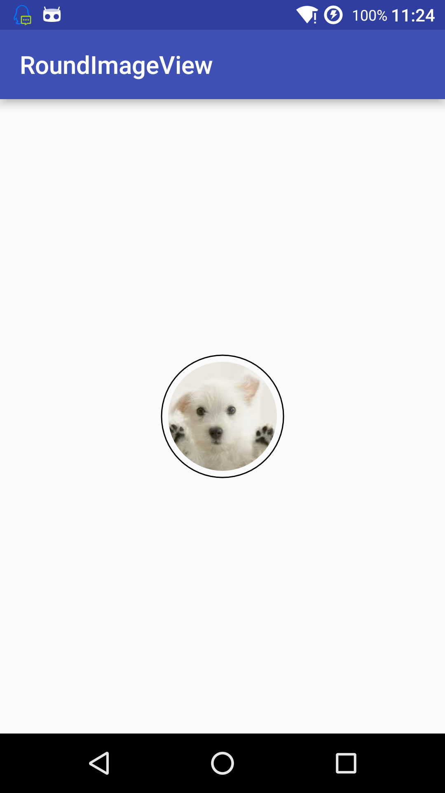

### RoundImageView
一个可以设置边框以及边框间距的ImageView, 基于Alan的代码修改。

#### 参数设置：

**border_thickness**
边框的宽度，如果为０，则不显示

**border_inside_color**
内边框的颜色

**border_outside_color**
外边框的颜色

**border_outside_padding**
外边框与里面图的间距
